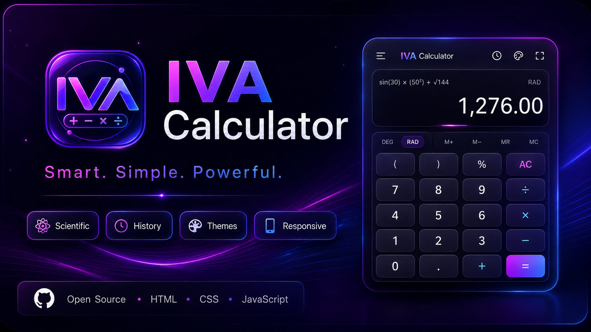
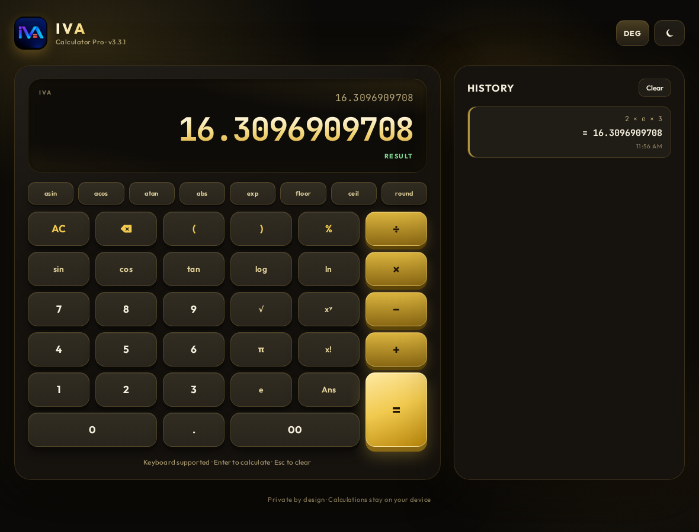
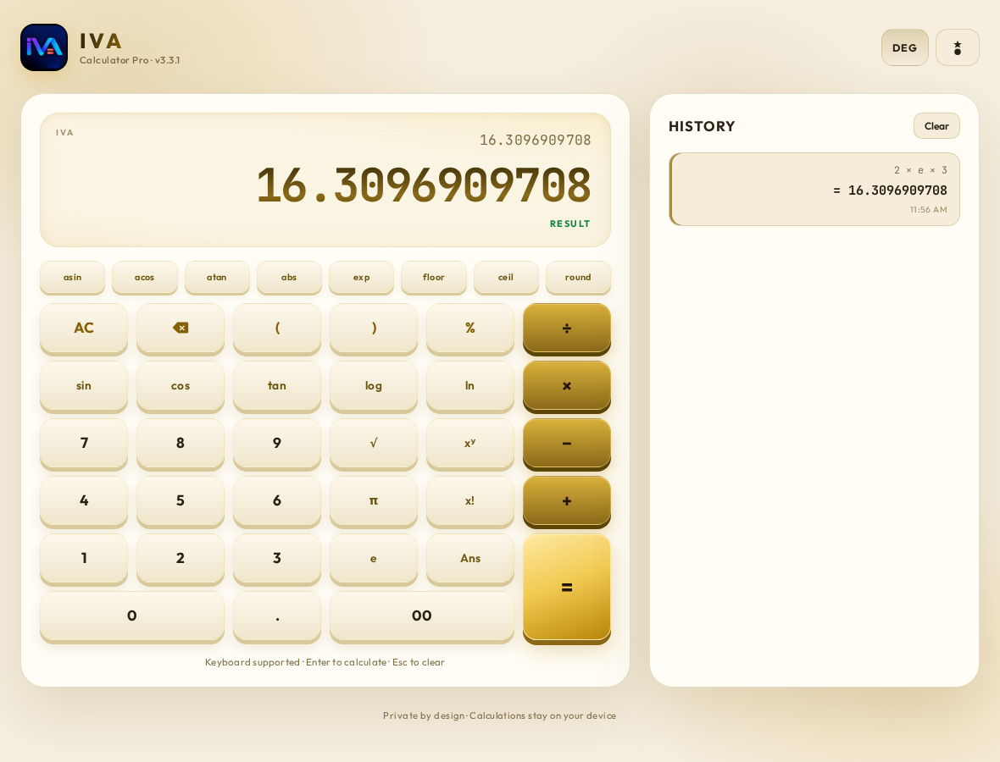
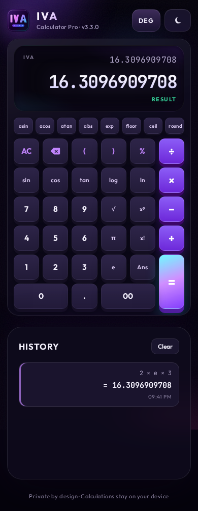

<div align="center">



# IVA Calculator Pro

**A private, dependency-free scientific calculator that runs entirely in your browser.**
**یک ماشین‌حساب علمی خصوصی و بدون‌وابستگی که کاملاً داخل مرورگر اجرا می‌شود.**

[](https://github.com/Kourosh242/iva-calculator/actions/workflows/deploy.yml)
[](#-changelog--تاریخچه-تغییرات)
[](LICENSE)
[](#-tech-stack--فناوری-ها)
[](CONTRIBUTING.md)
[](#-tech-stack--فناوری-ها)
[](#-installation--نصب)
[](#-english)

</div>

---

# 🇬🇧 English

A modern, fast, and secure scientific calculator built with vanilla JavaScript — no frameworks, no runtime dependencies, no tracking. Every calculation happens locally on your device and stays there.

IVA Calculator Pro centers on four principles: **privacy by design, mathematical accuracy, a polished user experience, and a genuinely safe evaluation engine** that never uses `eval()` or `new Function()`.

## 📑 Table of Contents

- [Overview](#-overview)
- [Screenshots](#-screenshots)
- [Key Features](#-key-features)
- [Why IVA Calculator Pro?](#-why-iva-calculator-pro)
- [Quick Start](#-quick-start)
- [Usage Guide](#-usage-guide)
- [Keyboard Shortcuts](#-keyboard-shortcuts)
- [Architecture](#-architecture)
- [Project Structure](#-project-structure)
- [Tech Stack](#-tech-stack)
- [Testing](#-testing)
- [Privacy & Security](#-privacy--security)
- [Roadmap](#-roadmap)
- [FAQ](#-faq)
- [Contributing](#-contributing)
- [License](#-license)
- [Changelog](#-changelog--تاریخچه-تغییرات)

## 🧭 Overview

IVA Calculator Pro is a Progressive Web App (PWA) that you can install on your phone or desktop and use fully offline. It supports scientific functions, trigonometry in both degrees and radians, powers, factorials, percentages, implicit multiplication, and a persistent calculation history — all evaluated by a hand-written [recursive-descent parser](docs/wiki/Parser.md).

| | |
|---|---|
| **Runtime dependencies** | `0` — pure vanilla JS, HTML, and CSS |
| **Bundle size** | A handful of kilobytes, no build step |
| **Data sent to servers** | `0` bytes |
| **Installable / offline** | ✅ PWA with a service worker |
| **Evaluation engine** | Hand-written parser — never `eval()` |

## 🖼 Screenshots

<p align="center">
  
  &nbsp;
  
</p>
<p align="center">
  <em>Dark (gold-on-black) and light (cream/gold) themes</em>
</p>

<p align="center">
  
</p>
<p align="center">
  <em>Responsive mobile layout</em>
</p>

## ✨ Key Features

- 🔒 **Safe evaluation engine** — a recursive-descent parser. No `eval`, no `new Function`, no dynamic execution of any kind.
- 🧮 **Full scientific mode** — `sin`, `cos`, `tan`, `asin`, `acos`, `atan`, `sqrt`, `log`, `ln`, `exp`, `abs`, `floor`, `ceil`, `round`, factorials (`!`), percentages (`%`), and powers (`^`).
- 📐 **DEG / RAD modes** — switch trigonometry between degrees and radians with a single tap.
- 🔢 **Constants** — `π` (pi) and `e` (Euler's number), plus an `Ans` button to reuse the last result.
- ⚡ **Smart implicit multiplication** — `2pi`, `3(4+1)`, and `2π(3)` all just work.
- 🧠 **Live preview** — the result updates in real time as you type.
- 📜 **Persistent history** — the last 20 calculations are stored locally and can be recalled with one click.
- 🌗 **Dark & light themes** — a premium gold-on-black palette, with a matching cream/gold light theme. Your choice is remembered.
- ⌨️ **Full keyboard support** — type naturally; `Enter` calculates, `Esc`/`Delete` clears, `Backspace` deletes.
- 📱 **Installable PWA** — add it to your home screen and use it completely offline.
- ♿ **Accessible & responsive** — semantic HTML, ARIA labels, reduced-motion support, and a layout that adapts from phone to desktop.
- 🛡️ **Hardened input** — invalid operator stacking, double decimals, and dangerous continuations are blocked at the input boundary before they ever reach the parser.

## 🎯 Why IVA Calculator Pro?

Most browser calculators lean on `eval()` or a library. `eval()` is a security risk; libraries add weight and a supply chain. IVA Calculator Pro instead ships a tiny, audited parser that:

1. **Cannot run arbitrary code** — there is no string evaluation path. Inputs like `process.exit()` simply throw "Unknown name".
2. **Stays tiny and fast** — no framework, no build step, no runtime dependency.
3. **Reports errors clearly** — messages like *Division by zero* or *Factorial needs a non-negative integer* point at exactly what went wrong.
4. **Protects your data** — expressions, results, and history never leave your device.

See the [Parser design](docs/wiki/Parser.md) wiki page for the full grammar and the [Privacy & Security](docs/wiki/Privacy-and-Security.md) page for the data model.

## 🚀 Quick Start

```bash
# 1. Install dev tooling (Playwright + ESLint)
npm install

# 2. Serve the app locally
npm run serve
```

Then open **http://localhost:4173** in your browser.

> **No install required to just look around.** You can also open `index.html` directly — but a local server is needed for keyboard shortcuts and the service worker to register.

### Install as an app

Open the deployed site in Chrome/Edge, click the **install** icon in the address bar, and IVA Calculator Pro becomes an offline-capable app on your device.

## 📖 Usage Guide

| Expression | Result | Notes |
|---|---|---|
| `2 + 3 * 4` | `14` | Standard precedence |
| `(2 + 3) * 4` | `20` | Parentheses |
| `2^3^2` | `512` | Right-associative powers |
| `-2^2` | `-4` | Unary minus binds looser than `^` |
| `5!` | `120` | Factorial |
| `50% * 200` | `100` | Percentage |
| `2pi` | `6.28318530718` | Implicit multiplication with π |
| `3(4+1)` | `15` | Implicit multiplication with parentheses |
| `sin(30)` | `0.5` | DEG mode (default) |
| `sin(pi/2)` | `1` | RAD mode |
| `sqrt(81) + log(100) + ln(e)` | `12` | Chained functions |
| `2E3` | `2000` | Scientific notation (uppercase **E**) |
| `2e3` | `16.3096909708` | Lowercase **e** is Euler → `2 × e × 3` |
| `ans * 2` | *(twice last result)* | `Ans` reuses the previous answer |

> **The `e` / `E` distinction matters.** Uppercase `E` is scientific notation (`2E3` = 2000); lowercase `e` is always Euler's number. This keeps the `e` key unambiguous.

## ⌨️ Keyboard Shortcuts

| Key | Action |
|---|---|
| `0`–`9`, `.`, `+ - * / ^ ( ) ! %` | Enter the matching token |
| `Enter` or `=` | Calculate |
| `Backspace` | Delete the last token |
| `Esc` or `Delete` | Clear all |
| `×`, `÷`, `−` | Aliased to `* / -` |

See the full [Keyboard Shortcuts](docs/wiki/Keyboard-Shortcuts.md) wiki page for details and the function-key map.

## 🏗 Architecture

```
index.html ──► src/app.js (UI controller & state)
                  │
                  ├─► src/input.js   (input rules: what may be typed next)
                  ├─► src/format.js  (number & expression display formatting)
                  └─► src/parser.js  (tokenizer + recursive-descent evaluator)
sw.js ───────► Service worker (network-first caching, offline shell)
```

The interface is intentionally split into **pure modules** (`input.js`, `format.js`, `parser.js`) that hold no DOM references and are therefore unit-testable in Node — and a thin **controller** (`app.js`) that wires those modules to the DOM.

Read the full breakdown in the [Architecture](docs/wiki/Architecture.md) wiki page.

## 📁 Project Structure

```
iva-calculator/
├── index.html               # Single-page app shell
├── manifest.webmanifest     # PWA manifest
├── sw.js                    # Service worker (offline + auto-update)
├── src/
│   ├── app.js               # UI controller, state, history, keyboard
│   ├── parser.js            # Tokenizer + recursive-descent parser
│   ├── input.js             # Pure input-validation rules
│   ├── format.js            # Pure number/expression formatting
│   └── style.css            # Gold-on-black theme (dark + light)
├── tests/
│   ├── parser.test.js       # Parser unit tests
│   ├── input.test.js        # Input-rule unit tests
│   ├── format.test.js       # Format round-trip tests
│   ├── release.test.js      # Version/asset integrity tests
│   └── e2e.spec.js          # Playwright browser tests
├── scripts/                 # QA & simulation helpers
├── docs/wiki/               # 📚 Canonical wiki source (synced to GitHub Wiki)
├── release/                 # Per-version release notes
├── .github/workflows/       # CI: test → build → deploy + wiki sync
└── assets/                  # Icons, banner, screenshots
```

## 🧪 Tech Stack

- **JavaScript (ES2022+)** — native ES modules, no transpiler, no bundler.
- **HTML5 + CSS custom properties** — theming via CSS variables, reduced-motion aware.
- **Service Worker API** — offline-first PWA with a network-first, self-updating cache.
- **Node `node:test`** — zero-dependency unit tests.
- **Playwright** — real-browser end-to-end tests.
- **ESLint** — flat config enforcing `no-eval` / `no-new-func` as hard errors.

## ✅ Testing

```bash
npm run lint        # ESLint (no-eval is an error)
npm test            # Node unit tests (parser, input, format, release)
npm run test:e2e    # Playwright browser tests (needs: npx playwright install)
npm run verify      # lint + unit + e2e, all in one
```

The suite covers precedence, parentheses, scientific functions, both angle modes, error paths (division by zero, `tan(90)`, `sqrt(-1)`), strict input rules, formatting round-trips, and service-worker upgrade integrity. See the [Testing](docs/wiki/Testing.md) wiki page.

## 🔐 Privacy & Security

- **No network calls for your data.** Expressions, results, and history are stored only in your browser's `localStorage` and never transmitted.
- **No `eval()`.** A hand-written parser is the only evaluation path, so untrusted input cannot execute code.
- **Defensive storage.** Every `localStorage` access is wrapped so the app keeps working in sandboxed iframes and private-browsing modes, and stored history is validated on read.
- **Installable & offline.** As a PWA with a service worker, it runs with no internet connection at all.

Read the full [Privacy & Security](docs/wiki/Privacy-and-Security.md) wiki page.

## 🗺 Roadmap

- [ ] Additional functions (`csc`, `sec`, `cot`, `log₂`, `xroot`)
- [ ] Memory keys (`M+`, `MR`, `MC`)
- [ ] Unit conversion helpers
- [ ] Even more keyboard ergonomics and localization

Have an idea? Open an [issue](https://github.com/Kourosh242/iva-calculator/issues) or a pull request.

## ❓ FAQ

**Does it work offline?** Yes — install it as a PWA and it runs fully offline via the service worker.

**Is my data sent anywhere?** No. Everything stays in your browser's local storage.

**Why doesn't `2e3` equal `2000`?** Lowercase `e` is Euler's number; use uppercase `E` for scientific notation. See [FAQ](docs/wiki/FAQ.md).

## 🤝 Contributing

Contributions are welcome! Please read [CONTRIBUTING.md](CONTRIBUTING.md) and the [Contributing](docs/wiki/Contributing.md) wiki page first. In short:

1. Fork and branch.
2. Keep it dependency-free — never introduce `eval` or `Function`.
3. Add parser tests for any new operator or function.
4. Run `npm run verify` before opening a PR.

## 📄 License

Released under the [MIT License](LICENSE).

---

# 🇮🇷 فارسی

یک ماشین‌حساب علمی مدرن، سریع و امن که فقط با جاوااسکریپت خالص ساخته شده — بدون فریم‌ورک، بدون وابستگی زمان اجرا، و بدون ردیابی. تمام محاسبات به‌صورت محلی روی دستگاه شما انجام می‌شود و همان‌جا می‌ماند.

IVA Calculator Pro بر چهار اصل استوار است: **حریم خصوصی در طراحی، دقت ریاضی، تجربهٔ کاربری صیقلی، و یک موتور ارزیابی واقعاً امن** که هرگز از `eval()` یا `new Function()` استفاده نمی‌کند.

## 📑 فهرست

- [معرفی](#معرفی)
- [تصاویر](#تصاویر)
- [امکانات کلیدی](#امکانات-کلیدی)
- [چرا IVA Calculator Pro؟](#چرا-iva-calculator-pro)
- [شروع سریع](#شروع-سریع)
- [راهنمای استفاده](#راهنمای-استفاده)
- [میانبرهای صفحه‌کلید](#میانبرهای-صفحه‌کلید)
- [معماری](#معماری)
- [ساختار پروژه](#ساختار-پروژه)
- [فناوری‌ها](#فناوری‌ها)
- [تست‌ها](#تست‌ها)
- [حریم خصوصی و امنیت](#حریم-خصوصی-و-امنیت)
- [نقشه راه](#نقشه-راه)
- [سوالات متداول](#سوالات-متداول)
- [مشارکت](#مشارکت)
- [مجوز](#مجوز)

## معرفی

IVA Calculator Pro یک وب‌اپلیکیشن پیشرونده (PWA) است که می‌توانید آن را روی گوشی یا دسکتاپ نصب کنید و کاملاً آفلاین استفاده کنید. این ماشین‌حساب از توابع علمی، مثلثات به دو حالت درجه و رادیان، توان، فاکتوریل، درصد، ضرب ضمنی و تاریخچهٔ ماندگار پشتیبانی می‌کند — همگی توسط یک [پارسر بازگشتی دست‌نویس](docs/wiki/Parser.md) ارزیابی می‌شوند.

| | |
|---|---|
| **وابستگی زمان اجرا** | `۰` — جاوااسکریپت/HTML/CSS خالص |
| **حجم بسته** | چند کیلوبایت، بدون مرحلهٔ build |
| **دادهٔ ارسالی به سرور** | `۰` بایت |
| **قابل نصب / آفلاین** | ✅ به‌صورت PWA همراه سرویس‌ورکر |
| **موتور ارزیابی** | پارسر دست‌نویس — هرگز `eval()` |

## تصاویر

<p align="center">
  
  &nbsp;
  
</p>
<p align="center">
  <em>حالت تاریک (طلایی روی مشکی) و روشن (کرم/طلایی)</em>
</p>

## امکانات کلیدی

- 🔒 **موتور ارزیابی امن** — پارسر بازگشتی. بدون `eval`، بدون `new Function`، بدون هیچ اجرای پویا.
- 🧮 **حالت علمی کامل** — `sin`، `cos`، `tan`، `asin`، `acos`، `atan`، `sqrt`، `log`، `ln`، `exp`، `abs`، `floor`، `ceil`، `round`، فاکتوریل (`!`)، درصد (`%`) و توان (`^`).
- 📐 **حالت DEG / RAD** — جابه‌جایی مثلثات بین درجه و رادیان با یک ضربه.
- 🔢 **ثابت‌ها** — `π` و `e`، به‌علاوهٔ دکمهٔ `Ans` برای استفادهٔ مجدد از آخرین نتیجه.
- ⚡ **ضرب ضمنی هوشمند** — `2pi`، `3(4+1)` و `2π(3)` همگی کار می‌کنند.
- 🧠 **پیش‌نمایش زنده** — نتیجه هنگام تایپ به‌روز می‌شود.
- 📜 **تاریخچهٔ ماندگار** — ۲۰ محاسبهٔ اخیر به‌صورت محلی ذخیره و با یک کلیک قابل فراخوانی.
- 🌗 **حالت تاریک و روشن** — پالت لوکس طلایی-بر-مشکی همراه نسخهٔ روشن هماهنگ. انتخاب شما به‌خاطر سپرده می‌شود.
- ⌨️ **پشتیبانی کامل صفحه‌کلید** — طبیعی تایپ کنید؛ `Enter` محاسبه، `Esc`/`Delete` پاک‌سازی، `Backspace` حذف.
- 📱 **PWA قابل نصب** — به صفحهٔ خانه اضافه‌اش کنید و کاملاً آفلاین استفاده کنید.
- ♿ **دسترس‌پذیر و واکنش‌گرا** — HTML معنایی، برچسب‌های ARIA، پشتیبانی از reduced-motion و چیدمانی که از گوشی تا دسکتاپ سازگار است.
- 🛡️ **ورودی سخت‌گیرانه** — پشته‌شدن عملگرها، اعشار مضاعف و ادامههای خطرناک در مرز ورودی مسدود می‌شوند، پیش از آن‌که به پارسر برسند.

## چرا IVA Calculator Pro؟

بسیاری از ماشین‌حساب‌های مرورگری به `eval()` یا یک کتابخانه تکیه می‌کنند. `eval()` یک ریسک امنیتی است و کتابخانه‌ها حجم و زنجیرهٔ تأمین اضافه می‌آورند. IVA Calculator Pro به‌جای آن یک پارسر کوچک و حسابرسی‌شده ارائه می‌دهد که:

۱. **نمی‌تواند کد دلخواه اجرا کند** — مسیر ارزیابی رشته‌ای وجود ندارد. ورودی‌هایی مثل `process.exit()` فقط خطای «Unknown name» می‌دهند.
۲. **کوچک و سریع می‌ماند** — بدون فریم‌ورک، بدون build، بدون وابستگی زمان اجرا.
۳. **خطاها را شفاف گزارش می‌دهد** — پیام‌هایی مثل «Division by zero» دقیقاً مشکل را نشان می‌دهند.
۴. **از داده‌های شما محافظت می‌کند** — عبارت‌ها، نتایج و تاریخچه هرگز دستگاه شما را ترک نمی‌کنند.

برای مشاهدهٔ کامل گرامر به صفحهٔ [طراحی پارسر](docs/wiki/Parser.md) و برای مدل داده به [حریم خصوصی و امنیت](docs/wiki/Privacy-and-Security.md) مراجعه کنید.

## شروع سریع

```bash
# ۱. نصب ابزار توسعه (Playwright + ESLint)
npm install

# ۲. اجرای برنامه به‌صورت محلی
npm run serve
```

سپس آدرس **http://localhost:4173** را در مرورگر باز کنید.

> **برای مرور سریع نیازی به نصب نیست.** می‌توانید مستقیماً `index.html` را باز کنید — اما برای میانبرهای صفحه‌کلید و ثبت سرویس‌ورکر به یک سرور محلی نیاز است.

### نصب به‌عنوان اپلیکیشن

سایت مستقرشده را در Chrome/Edge باز کنید، روی آیکون **نصب** در نوار آدرس کلیک کنید تا IVA Calculator Pro یک اپلیکیشن آفلاین روی دستگاه شما شود.

## راهنمای استفاده

| عبارت | نتیجه | توضیح |
|---|---|---|
| `2 + 3 * 4` | `14` | تقدم استاندارد |
| `(2 + 3) * 4` | `20` | پرانتز |
| `2^3^2` | `512` | توان راست‌پیوند |
| `-2^2` | `-4` | منفی یکانی ضعیف‌تر از `^` |
| `5!` | `120` | فاکتوریل |
| `50% * 200` | `100` | درصد |
| `2pi` | `6.28318530718` | ضرب ضمنی با π |
| `3(4+1)` | `15` | ضرب ضمنی با پرانتز |
| `sin(30)` | `0.5` | حالت درجه (پیش‌فرض) |
| `sin(pi/2)` | `1` | حالت رادیان |
| `sqrt(81) + log(100) + ln(e)` | `12` | زنجیرهٔ توابع |
| `2E3` | `2000` | نماد علمی (**E** بزرگ) |
| `2e3` | `16.3096909708` | **e** کوچک عدد اویلر است → `2 × e × 3` |
| `ans * 2` | *(دوبرابر نتیجهٔ قبلی)* | `Ans` جواب قبلی را بازمی‌گرداند |

> **تمایز `e` / `E` مهم است.** `E` بزرگ نماد علمی است (`2E3` = 2000) و `e` کوچک همیشه عدد اویلر است. این کار کلید `e` را یکپارچه نگه می‌دارد.

## میانبرهای صفحه‌کلید

| کلید | عملکرد |
|---|---|
| `0`–`9`, `.`, `+ - * / ^ ( ) ! %` | وارد کردن توکن متناظر |
| `Enter` یا `=` | محاسبه |
| `Backspace` | حذف آخرین توکن |
| `Esc` یا `Delete` | پاک‌سازی همه |
| `×`، `÷`، `−` | معادل `* / -` |

برای جزئیات بیشتر و نقشهٔ کلیدهای علمی به صفحهٔ [میانبرهای صفحه‌کلید](docs/wiki/Keyboard-Shortcuts.md) مراجعه کنید.

## معماری

```
index.html ──► src/app.js (کنترل‌کنندهٔ رابط و وضعیت)
                  │
                  ├─► src/input.js   (قوانین ورودی: چه چیزی ممکن است تایپ شود)
                  ├─► src/format.js  (قالب‌بندی نمایش عدد و عبارت)
                  └─► src/parser.js  (توکنایزر + ارزیاب بازگشتی)
sw.js ───────► سرویس‌ورکر (کش network-first، پوستهٔ آفلاین)
```

رابط عمداً به **ماژول‌های خالص** (`input.js`، `format.js`، `parser.js`) تقسیم شده که هیچ ارجاعی به DOM ندارند و در Node قابل تست واحد هستند — و یک **کنترل‌کنندهٔ نازک** (`app.js`) که این ماژول‌ها را به DOM متصل می‌کند.

شرح کامل در صفحهٔ [معماری](docs/wiki/Architecture.md).

## ساختار پروژه

```
iva-calculator/
├── index.html               # ساختار اپلیکیشن تک‌صفحه‌ای
├── manifest.webmanifest     # مانیفست PWA
├── sw.js                    # سرویس‌ورکر (آفلاین + به‌روزرسانی خودکار)
├── src/
│   ├── app.js               # کنترل‌کنندهٔ رابط، وضعیت، تاریخچه، صفحه‌کلید
│   ├── parser.js            # توکنایزر + پارسر بازگشتی
│   ├── input.js             # قوانین خالص اعتبارسنجی ورودی
│   ├── format.js            # قالب‌بندی خالص عدد/عبارت
│   └── style.css            # تم طلایی-مشکی (تاریک + روشن)
├── tests/
│   ├── parser.test.js       # تست‌های واحد پارسر
│   ├── input.test.js        # تست‌های واحد قوانین ورودی
│   ├── format.test.js       # تست‌های رفت‌وبرگشت قالب‌بندی
│   ├── release.test.js      # تست‌های یکپارچگی نسخه/دارایی
│   └── e2e.spec.js          # تست‌های مرورگری Playwright
├── scripts/                 # ابزارهای QA و شبیه‌سازی
├── docs/wiki/               # 📚 منبع اصلی ویکی (با GitHub Wiki همگام می‌شود)
├── release/                 # یادداشت‌های انتشار هر نسخه
├── .github/workflows/       # CI: تست → build → استقرار + همگام‌سازی ویکی
└── assets/                  # آیکون‌ها، بنر، اسکرین‌شات‌ها
```

## فناوری‌ها

- **جاوااسکریپت (ES2022+)** — ماژول‌های ES بومی، بدون ترانسپایلر، بدون باندلر.
- **HTML5 و CSS Custom Properties** — قالب‌بندی با متغیرهای CSS و پشتیبانی از reduced-motion.
- **Service Worker API** — PWA آفلاین‌محور با کش network-first و خودبه‌روزرسانی.
- **`node:test`** — تست‌های واحد بدون وابستگی.
- **Playwright** — تست‌های سرتاسری در مرورگر واقعی.
- **ESLint** — پیکربندی flat که `no-eval` / `no-new-func` را خطای سخت در نظر می‌گیرد.

## تست‌ها

```bash
npm run lint        # ESLint (no-eval یک خطا است)
npm test            # تست‌های واحد Node (پارسر، ورودی، قالب، نسخه)
npm run test:e2e    # تست‌های مرورگری Playwright (نیازمند: npx playwright install)
npm run verify      # lint + واحد + e2e در یک دستور
```

این مجموعه تقدم، پرانتز، توابع علمی، هر دو حالت زاویه، مسیرهای خطا (تقسیم بر صفر، `tan(90)`، `sqrt(-1)`)، قوانین سخت‌گیرانهٔ ورودی، رفت‌وبرگشت قالب‌بندی و یکپارچگی به‌روزرسانی سرویس‌ورکر را پوشش می‌دهد. به صفحهٔ [تست‌ها](docs/wiki/Testing.md) مراجعه کنید.

## حریم خصوصی و امنیت

- **هیچ فراخوانی شبکه‌ای برای داده‌های شما.** عبارت‌ها، نتایج و تاریخچه فقط در `localStorage` مرورگر شما ذخیره و هرگز منتقل نمی‌شوند.
- **بدون `eval()`.** پارسر دست‌نویس تنها مسیر ارزیابی است، پس ورودی نامعتبر نمی‌تواند کد اجرا کند.
- **ذخیره‌سازی تدافعی.** هر دسترسی به `localStorage` محافظت شده تا برنامه در iframeهای سندباکس‌شده و حالت خصوصی هم کار کند، و تاریخچه هنگام خواندن اعتبارسنجی می‌شود.
- **قابل نصب و آفلاین.** به‌عنوان PWA با سرویس‌ورکر، بدون هیچ اتصال اینترنتی اجرا می‌شود.

شرح کامل در صفحهٔ [حریم خصوصی و امنیت](docs/wiki/Privacy-and-Security.md).

## نقشه راه

- [ ] توابع بیشتر (`csc`, `sec`, `cot`, `log₂`, `xroot`)
- [ ] کلیدهای حافظه (`M+`, `MR`, `MC`)
- [ ] ابزارهای تبدیل واحد
- [ ] ارگونومی بیشتر صفحه‌کلید و بومی‌سازی

ایده‌ای دارید؟ یک [issue](https://github.com/Kourosh242/iva-calculator/issues) یا pull request باز کنید.

## سوالات متداول

**آیا آفلاین کار می‌کند؟** بله — آن را به‌عنوان PWA نصب کنید و از طریق سرویس‌ورکر کاملاً آفلاین اجرا می‌شود.

**آیا داده‌هایم جایی ارسال می‌شود؟** خیر. همه‌چیز در حافظهٔ محلی مرورگر شما می‌ماند.

**چرا `2e3` برابر `2000` نیست؟** `e` کوچک عدد اویلر است؛ برای نماد علمی از `E` بزرگ استفاده کنید. به [سوالات متداول](docs/wiki/FAQ.md) مراجعه کنید.

## مشارکت

از مشارکت شما استقبال می‌شود! لطفاً ابتدا [CONTRIBUTING.md](CONTRIBUTING.md) و صفحهٔ [مشارکت](docs/wiki/Contributing.md) را بخوانید. به‌اختصار:

۱. Fork کنید و یک شاخه بسازید.
۲. پروژه را بدون‌وابستگی نگه دارید — هرگز `eval` یا `Function` وارد نکنید.
۳. برای هر عملگر یا تابع جدید، تست پارسر اضافه کنید.
۴. پیش از باز کردن PR، `npm run verify` را اجرا کنید.

## مجوز

تحت [مجوز MIT](LICENSE) منتشر شده است.

---

<div align="center">

<sub>📚 **Wiki / ویکی:** [Home](docs/wiki/Home.md) · [Features](docs/wiki/Features.md) · [Installation](docs/wiki/Installation.md) · [Architecture](docs/wiki/Architecture.md) · [Parser](docs/wiki/Parser.md) · [API](docs/wiki/API.md) · [Keyboard](docs/wiki/Keyboard-Shortcuts.md) · [Development](docs/wiki/Development.md) · [Testing](docs/wiki/Testing.md) · [Contributing](docs/wiki/Contributing.md) · [Privacy](docs/wiki/Privacy-and-Security.md) · [FAQ](docs/wiki/FAQ.md) · [Changelog](docs/wiki/Changelog.md)</sub>

<sub>Private by design · Calculations stay on your device · خصوصی در طراحی · محاسبات روی دستگاه شما می‌ماند</sub>

</div>
