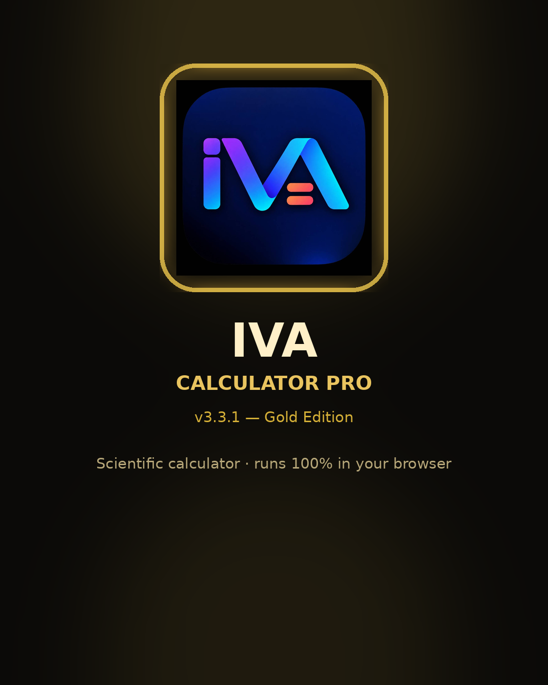

# 🧮 IVA Calculator Pro

<p align="center">
  
</p>

<h1 align="center">
IVA Calculator Pro
</h1>

<p align="center">
<b>Smart. Simple. Powerful.</b>
</p>

<p align="center">
A professional open-source scientific calculator built with modern JavaScript architecture, custom AST expression engine, responsive UI, PWA support and developer-focused tools.
</p>

<p align="center">

</p>

---

# 🚀 Overview

**IVA Calculator Pro** یک ماشین حساب حرفه‌ای، سریع و قابل توسعه است که با هدف ساخت یک پروژه Open Source واقعی طراحی شده است.

این پروژه فقط یک ماشین حساب ساده نیست؛ بلکه شامل:

* موتور محاسبات اختصاصی
* Parser مبتنی بر AST
* رابط کاربری مدرن Neon / Glass
* حالت علمی
* تاریخچه محاسبات
* تبدیل واحد
* حالت برنامه‌نویسی
* پشتیبانی PWA
* ساختار آماده توسعه توسط Community

است.

---

# ✨ Features

## 🧠 Advanced Calculation Engine

موتور محاسبات IVA بدون استفاده از `eval()` ساخته شده است.

ویژگی‌ها:

✅ Custom Expression Parser
✅ AST Architecture
✅ Operator Priority
✅ Nested Parentheses
✅ Error Handling

پشتیبانی:

* Addition `+`
* Subtraction `-`
* Multiplication `*`
* Division `/`
* Power `^`
* Parentheses `( )`

---

# 🔬 Scientific Mode

توابع علمی:

| Function  | Support |
| --------- | ------- |
| sin()     | ✅       |
| cos()     | ✅       |
| tan()     | ✅       |
| sinh()    | ✅       |
| cosh()    | ✅       |
| log()     | ✅       |
| ln()      | ✅       |
| √         | ✅       |
| ∛         | ✅       |
| Factorial | ✅       |
| Absolute  | ✅       |
| π         | ✅       |
| e         | ✅       |

Examples:

```
sin(30)

sqrt(144)

log(100)

5^3

fact(5)
```

---

# 🎨 Modern UI

<p align="center">

</p>

طراحی رابط کاربری:

* Glassmorphism
* Neon Glow
* Responsive Layout
* Smooth Animations
* Dark Theme
* Light Theme
* Mobile Friendly

---

# 📱 Screenshots

## Desktop


## Mobile


---

# 🎬 Demo

<p align="center">

</p>

---

# 🛠 Technology Stack

Built with:

| Technology            | Usage                |
| --------------------- | -------------------- |
| HTML5                 | Structure            |
| CSS3                  | UI Design            |
| JavaScript ES Modules | Application Logic    |
| AST Parser            | Calculation Engine   |
| LocalStorage          | Data Persistence     |
| GitHub Actions        | CI/CD                |
| PWA                   | Installation Support |

---

# 📦 Installation

## Clone Repository

```bash
git clone https://github.com/MR-SHARIFI-Dev/iva-calculator.git
```

Enter project:

```bash
cd iva-calculator
```

Run:

```bash
open index.html
```

یا از یک Static Server استفاده کنید:

```bash
npm install
npm run dev
```

---

# 📂 Project Structure

```
IVA-Calculator-Pro
│
├── src
│   │
│   ├── core
│   │   ├── lexer.js
│   │   ├── parser.js
│   │   └── ast.js
│   │
│   ├── modules
│   │   ├── history.js
│   │   ├── converter.js
│   │   └── programmer.js
│   │
│   └── ui
│
├── assets
│   ├── logo.svg
│   ├── banner.png
│   ├── poster.png
│   ├── social-preview.png
│   └── screenshots
│
├── tests
│
├── .github
│   ├── ISSUE_TEMPLATE
│   ├── workflows
│   └── PULL_REQUEST_TEMPLATE.md
│
├── package.json
└── README.md
```

---

# 🧮 Additional Tools

## Unit Converter

Supported:

* Length
* Weight
* Temperature
* Area

---

## Programmer Mode

Developer tools:

* Decimal
* Binary
* Octal
* Hexadecimal

Example:

```
255

Binary:
11111111

Hex:
FF
```

---

## History System

Features:

✅ LocalStorage Save
✅ Delete Calculation
✅ Clear History
✅ Export History JSON
✅ Restore Previous Results

---

# 📲 PWA Support

IVA Calculator can be installed like a native application.

Features:

* Offline Mode
* Install Prompt
* Mobile App Experience
* Custom Icons
* Splash Screen

---

# 🌐 Live Demo

Demo:

```
https://MR-SHARIFI-Dev.github.io/iva-calculator/
```

---

# 🧪 Testing

Run tests:

```bash
npm test
```

Quality checks:

* JavaScript Tests
* Lighthouse Audit
* Performance Checks

---

# 🚀 GitHub Actions

Included workflows:

```
.github/workflows/

├── test.yml
├── lighthouse.yml
└── deploy.yml
```

Automatic:

* Testing
* Deployment
* Quality Checking

---

# 📌 Roadmap

## v1.0.0

Initial Release

* Basic Calculator
* Modern UI

---

## v1.1.0

Scientific Mode

* Advanced Functions
* History

---

## v2.0.0

IVA Pro Engine

* AST Parser
* Better Architecture

---

## v3.0.0

Production Release

* PWA
* Developer Tools
* Converter System
* Professional CI/CD

---

# 🤝 Contributing

Contribution is welcome.

Steps:

1. Fork Repository

2. Create Branch:

```bash
git checkout -b feature/new-feature
```

3. Commit:

```bash
git commit -m "Add new feature"
```

4. Push:

```bash
git push origin feature/new-feature
```

5. Create Pull Request

---

# 🐛 Report Issues

برای گزارش مشکل:

* Bug Report Template را استفاده کنید.
* اطلاعات مرورگر و سیستم را اضافه کنید.
* مراحل بازتولید مشکل را بنویسید.

---

# ⭐ Support

اگر پروژه برای شما مفید بود:

⭐ Star بدهید
🍴 Fork کنید
🤝 مشارکت کنید

---

# 📜 License

MIT License

Free to use, modify and distribute.

---

# 👨‍💻 Author

IVA Open Source Team

Built with ❤️ and JavaScript
